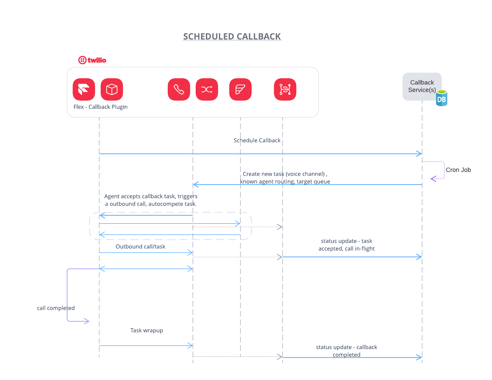

# Scheduled Callback Solution for Twilio Flex 




Built using:
* [Node.js](https://nodejs.org/en/)
* [Express](https://expressjs.com/)
* [SQL Server](https://www.microsoft.com/en-us/sql-server)

## Requirements 

If you don't already have access to SQL Server, you can install one locally for development and testing.

### Install SQL Server on Windows

Download and install [SQL Server Developer Edition](https://www.microsoft.com/en-us/sql-server/sql-server-downloads).

### Install SQL Server on Mac 

1. Install [Docker](https://docs.docker.com/docker-for-mac/install/)
1. Run the following in a terminal. Change the values of `container_name` and `SA_PASSWORD=P@***55w0rd***` to what you desire.

```bash
docker pull microsoft/mssql-server-linux:2017-latest
docker run -d --name container_name -e 'ACCEPT_EULA=Y' -e 'SA_PASSWORD=P@***55w0rd***' -e 'MSSQL_PID=Developer' -p 1433:1433 microsoft/mssql-server-linux:2017-latest
```

Make sure you have [Node.js](https://nodejs.org) as well as [`npm`](https://npmjs.com). We support Node >= 10.12 (and recommend the _even_ versions of Node). 

## Setup
1. Clone this repository (or download and extract the zip file)
2. Open a command prompt or terminal
3. Change to the directory `server\api` 
4. Run `npm install` to install all the dependencies
5. Copy `.env.sample` to `.env`, and modify the settings to match your environment


```bash
# SQL Server connection
SQL_USER=
SQL_PASSWORD=
SQL_DATABASE=
SQL_SERVER=
SQL_ENCRYPT=false

# TWILIO
ACCOUNT_SID=AC...
AUTH_TOKEN=
WORKSPACE_SID=WS...
```
### Initialize Your SQL Database

You will need a SQL database to for this application. If you are running SQL Server locally and don't already have a database, you can create one with the following script. You can use a utility like [Azure Data Studio](https://docs.microsoft.com/en-us/sql/azure-data-studio/download?view=sql-server-2017) to connect to your instance to run this script.

```sql
USE master;
GO

CREATE DATABASE CallbackScheduler; -- change this to whatever database name you desire
GO
```

Next you can run the following task at the command line or terminal to initialize your database. 

> Note: Make sure you have the correct server, database, user, and password configured in your `.env` file.

```bash
node tasks/initializedb.js
```

### Run the Local Web API


1. Change directory to `server/api`
2. Run `npm start` to start the development server. (Note: The default PORT=3000. A custom PORT can be specified in .env file)
3. Open new Terminal window and run `ngrok http http://localhost:3000`. Note the Forwarding ngrok URL/sub-domain returned. We will require this for setting up Event Streams Webhook sink.

### Event Streams 

1. Create a new Event Streams sink, type webhook. 
2. Enter ngrok domain `https://<subdomain>.ngrok.io/events`
3. Create event streams subscription for taskrouter (v2) events
    - reservation.accepted


### Task Router Workflow 

1. Create the "ScheduledCallback" workflow

  - Navigate to the workflow section in TaskRouter section of console
  - Click + to add a new workflow
  - Workflow name set to `ScheduledCallback`
  - Add a filter `Known Agent  with fall back to Everyone queue`
    - Click create a new filter
    - Click unamed filter to rename to `Known Agent  with fall back to Everyone queue`
    - Matching Tasks = `type == 'callback' && callback.routeToQueue == 'true'`
    - Task Queue = `Everyone`
    - Skip timeout = `workers.available == 0`
    - Timeout = `3600`
    - Known Worker, Select the radio button `Worker SID`, then enter the following expression `task.callback.workerSid`
    - Within the direct call to agent click `Add a Step`
    - In the second step, Task Queue = `Everyone`, All other setting can stay default

### Start the CRON Job

1. Change directory to `server/service`.
1. Run `npm install` to install all the dependencies
1. Copy `.env.sample` to `.env`, and modify the settings to match your environment

```bash
# SQL Server connection
SQL_USER=
SQL_PASSWORD=
SQL_DATABASE=
SQL_SERVER=
SQL_ENCRYPT=false

# TWILIO
ACCOUNT_SID=AC...
AUTH_TOKEN=
WORKSPACE_SID=WS...
CALLBACK_WORKFLOW_SID=WW... # workflow sid created in the previous step
```

4. Run `node cron-callback-schedule.js`


